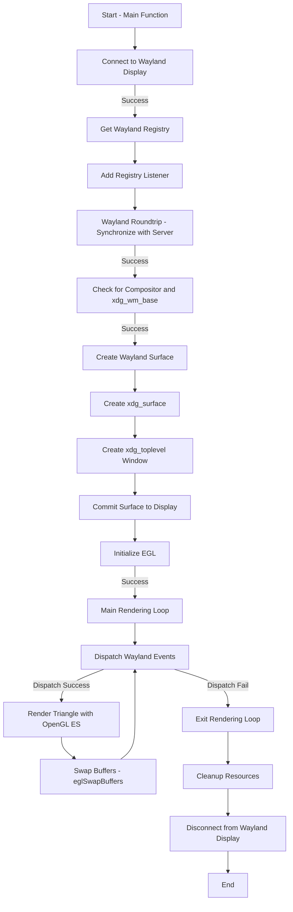

# Understanding Wayland Protocols

Just a knowledge dump of everything wayland 

## Goal

a. To comprehend how the Wayland Protocol is used and how it works
b. To be able to use `wayland-client`, `wayland-server` and other headers required to become a client of Wayland 
c. To be able to implement basic client-server interactions with Wayland 
d. To further understand how a Wayland based compositor would operate and function
e. Finally, just to experience "fun" while I die inside

## References 

- [Wayland Protocols](https://wayland.freedesktop.org/docs/html/index.html)

- [Wayland Book](https://wayland-book.com/)

- [Wayland gitlab](https://gitlab.freedesktop.org/wayland)

- [Swaylock GitHub Repo](https://github.com/swaywm/swaylock)

- [Writing Wayland Clients](https://bugaevc.gitbooks.io/writing-wayland-clients/content/)

- [Hyprlock GitHub Repo](https://github.com/hyprwm/hyprlock)

## Contents

-> References of materials I used to understanding how wayland works as a whole

-> Basic implementation of how I understood to use and become a wayland client by abiding certain protocols 

-> In detailed comments for myself and anyone who wants to understand how Wayland Objects, listeners, registry handling, ie. the code flow of using wayland basd headers work

1. [gettext.c](https://github.com/nots1dd/mywayland/blob/main/gettext.c): 

Gets keyboard input using `wl_keyboard_listener` struct and gets all seat listeners (keyboard, mouse pointer, so on) before taking in keyboard input

2. [render.c](https://github.com/nots1dd/mywayland/blob/main/render.c):



### Explanation:
- This flowchart captures the high-level execution of the Wayland and EGL program.
- Key steps like connecting to Wayland, initializing EGL, and entering the rendering loop are highlighted.
- The flow continues until `wl_display_dispatch` fails, after which resources are cleaned up and the program ends.

3. [xdg-shell-demo.c](https://github.com/nots1dd/mywayland/blob/main/xdg-shell-demo.c)

```mermaid
flowchart TD
    A[Start: main() Function] --> B[Connect to Wayland Display Server]
    B --> C[Get Registry for Global Objects]
    C --> D[Add Listener for Registry]
    D --> E[Roundtrip to Retrieve Global Objects]
    E --> F[Check Required Interfaces]
    
    F --> |"compositor not available"| G[Error: wl_compositor not available]
    F --> |"wm_base not available"| H[Error: xdg_wm_base not available]
    F --> |"seat not available"| I[Error: wl_seat not available]
    F --> |"shm not available"| J[Error: wl_shm not available]
    
    F --> K[All Interfaces Available]
    K --> L[Create Wayland Surface]
    L --> M[Get XDG Surface]
    M --> N[Create XDG Toplevel Window]
    N --> O[Add Listeners for XDG Toplevel Events]
    O --> P[Set Window Title]
    
    P --> Q[Configure Shared Memory Buffer]
    Q --> R[Open Anonymous File for Shared Memory]
    R --> S[Map File to Memory]
    S --> T[Create Shared Memory Pool]
    T --> U[Allocate Buffer in Shared Memory Pool]
    U --> V[Fill Buffer with Yellow Color]
    
    V --> W[Load Cursor Theme]
    W --> X[Get Cursor Image]
    X --> Y[Attach Buffer to Surface]
    Y --> Z[Initial Commit to Surface]
    
    Z --> AA[Enter Main Event Loop]
    AA --> AB[Dispatch Wayland Events]
    
    AB --> |"Exit Program"| AC[Cleanup Resources]
    AC --> AD[Unmap Shared Memory]
    AD --> AE[Destroy Buffer]
    AE --> AF[Destroy Shared Memory Pool]
    AF --> AG[Disconnect from Wayland Display Server]
    
    AG --> AH[End]
```

### Explanation
The provided code implements a basic Wayland client that creates a window displaying a solid yellow color using the stable XDG shell protocol. It connects to the Wayland display server, binds to necessary interfaces, and configures a shared memory buffer to hold pixel data for the window. The program sets the window title and displays a cursor while entering an infinite event loop to handle interactions. It is a basic example/implementation for building graphical applications in a Wayland environment.

## Footer

All unlisted files from this README are considered to be experimental and **DO NOT** work as intended, use them at your own risk
