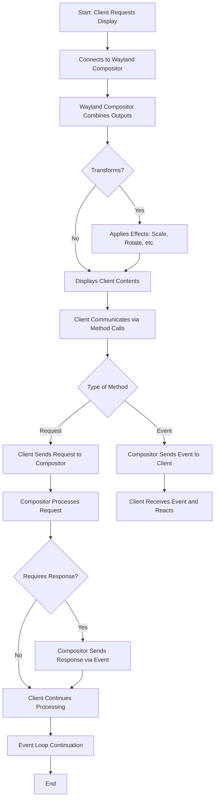

### Introduction to Wayland?

#### Overview of Wayland

Wayland is a protocol that facilitates communication between clients (applications) and a server known as the Wayland compositor. The compositor is responsible for combining the graphical output from multiple clients into a single display on the screen. While clients generate their own graphics, they do not need to concern themselves with any transformations or effects that the compositor might apply, such as scaling, rotating, or adding visual effects to the windows.

The communication between clients and the compositor occurs through a wire format, which defines how data is packaged, sent, and received. This interaction happens over a Unix domain socket typically located at a path like `/run/user/1000/wayland-0`. The compositor creates this socket when it starts, and it sets the `WAYLAND_DISPLAY` environment variable for clients, guiding them on how to connect.

Wayland follows an object-oriented model where all communications are made through method calls on abstract objects. There are two types of methods: requests (made by clients) and events (issued by the server). For example, a `wl_pointer` object can send a `set_cursor` request to change the cursor and receive a `motion` event that reports the cursor's movement. 

Messages sent between the client and server do not wait for a response, which helps to avoid delays associated with roundtrip communications. This non-blocking behavior makes Wayland asynchronous, allowing clients to continue processing while waiting for events from the server. When a client makes a request that logically requires a response, such as setting a window to fullscreen, the server replies with an event containing the new dimensions of the window, if applicable.

Another aspect of Wayland's design is that when creating a new object, the client provides its own ID to the server in the request, eliminating the need for a roundtrip delay that would occur if the server had to send the ID back to the client. 

Lastly, the Wayland protocol specifies concrete object types (interfaces) and their associated methods through the core protocol. The protocol is extensible, allowing new interfaces to be added as needed. One prominent extension is `xdg-shell`, which enhances the basic functionalities of the Wayland protocol.

#### Flowchart of Wayland Communication

